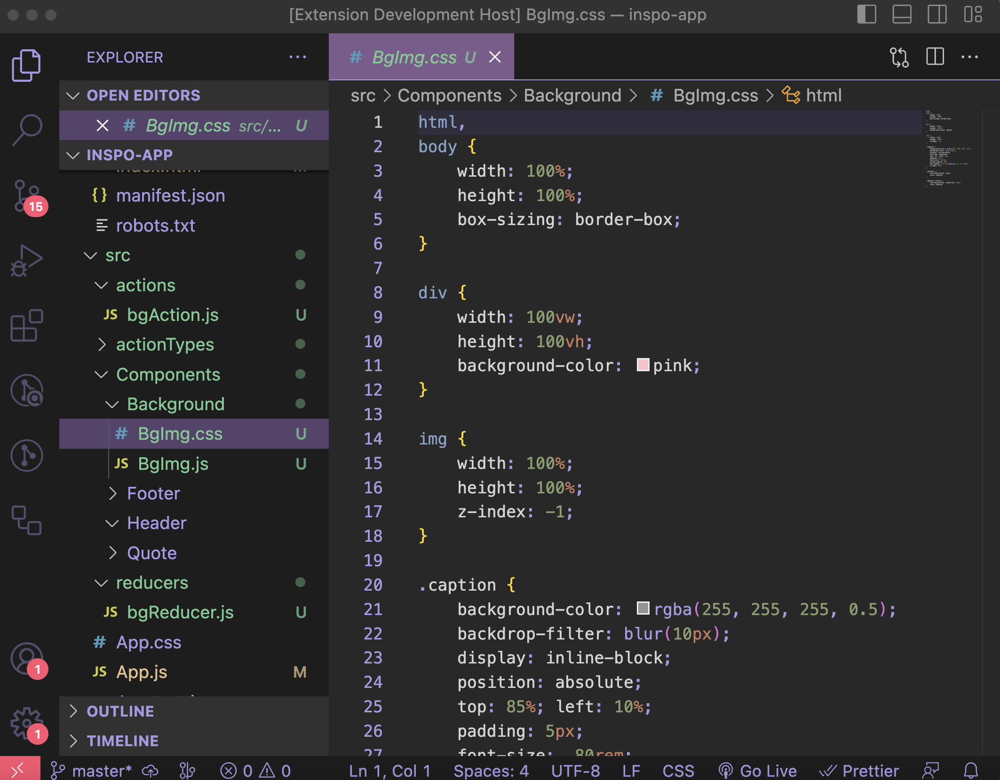
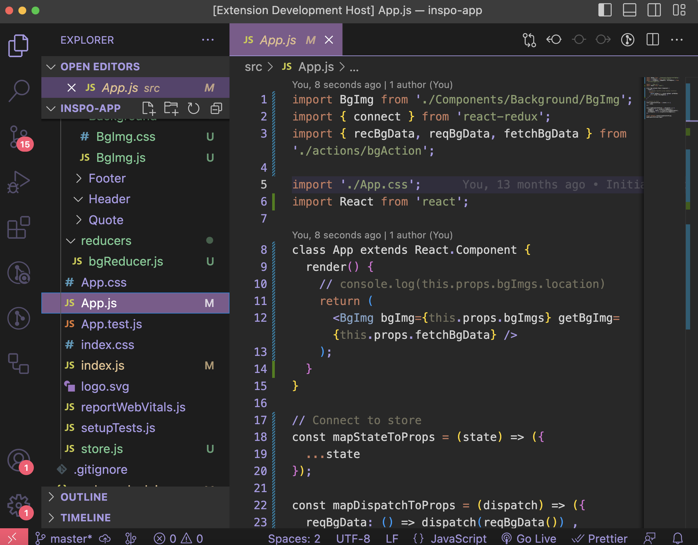
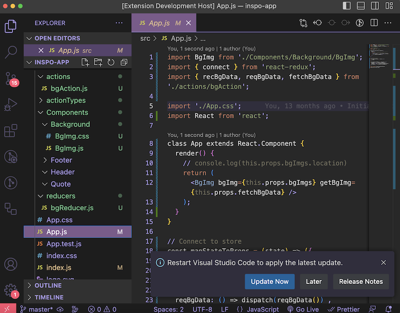

# Rhysand Dark 🧝🏻

This is Rhysand Dark: A breathtaking tribute to the High Lord of the Night Court from the ACOTAR series.

Step into a world of enchantment as your code editor transforms into a dark, mystical realm. The theme boasts a bewitching blend of twilight purples, deep blues, and silver accents that pay homage to the mesmerizing aesthetics of Rhysand's Night Court.
  

  
Every line of code becomes an adventure as you delve into the enchanting hues of this theme. 

The soothing background in dark purples provides a perfect backdrop for your code, while the elegant silver highlights add a touch of regal charm to your coding experience.
  

  
But it's not just about appearances. The Rhysand-inspired VS Code theme is thoughtfully designed for optimal readability and functionality. Your code will stand out with clarity, and you'll experience an immersive and elegant coding journey.
  

  
Whether you're a fan of the ACOTAR series or simply seeking a coding environment that exudes charisma and style, this theme is your portal to the Night Court's mystique!
athtaking VS Code theme.

Dive into the enchantment and experience the Night Court in every line of code. Get started with the Rhysand-inspired VS Code theme today and code like a High Lord.
