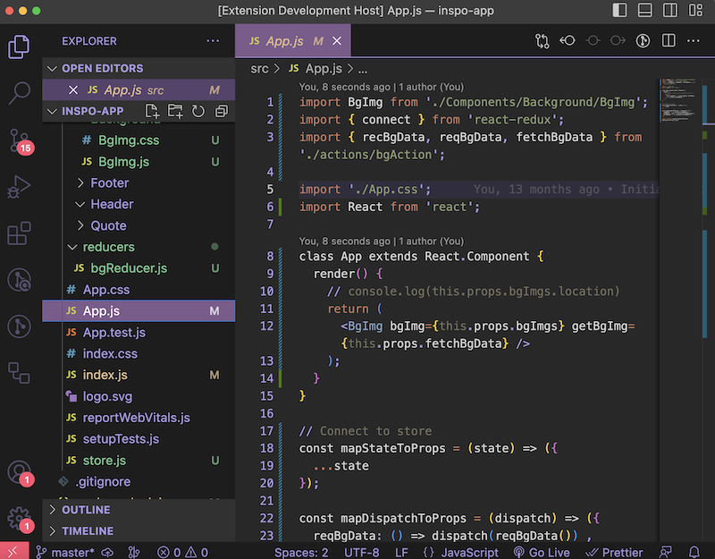

# Rhysand Dark 🧝🏻

Do you seeks a coding environment that exudes charisma and style? 

This is **Rhysand Dark**: a breathtaking tribute to the High Lord of the Night Court from the ACOTAR series.

Let your code editor transform into a dark, mystical realm. 

Rhysand Dark pays homage to the mesmerizing aesthetics of Rhysand's Night Court. It boasts a blend of twilight purples, deep blues, and silver accents.
  

  
Every line of code becomes an adventure as you delve into the enchanting hues of this theme. 

A soothing background in dark purples provides the perfect backdrop for your code. Elegant silver highlights add a touch of regal charm to your coding experience.
  

  
But it's not all about appearances. We thoughtfully designed this Rhysand-inspired VS Code theme for optimal readability and functionality.

Your code will stand out with clarity, and you'll experience an immersive and elegant coding journey.
  

  
This theme is your portal to the Night Court's mystique. Dive into the enchantment and experience the Night Court in every line of code. 

Get started with the Rhysand-inspired VS Code theme today and code like a High Lord 😉
  
**Link:** [VS Code Marketplace](https://marketplace.visualstudio.com/items?itemName=TheHelpfulTipper.rhysand-dark)